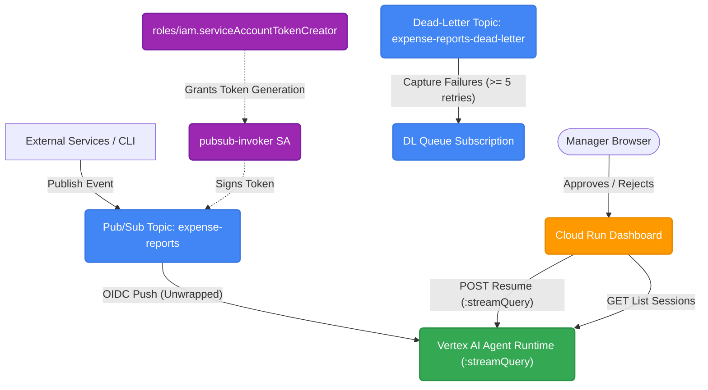

# Event-Driven Ambient Expense Agent & Dashboard
This repository contains the complete implementation of the **Ambient Expense Agent System** developed during the Day 4 codelabs. The project consists of an ADK (Agent Development Kit) backend agent running on Vertex AI, a public manager dashboard deployed on Cloud Run, and an automated event-driven ingestion pipeline powered by Google Cloud Pub/Sub.
---
## System Architecture
The following diagram illustrates how incoming expense events flow through the system:

---
## Core Components
### 1. [Backend Agent](file:///home/dishant/dishant_dev/AI_Agents_intensive_Course/Day4-codelabs/ambient-expense-agent) (`/ambient-expense-agent`)
An ADK-based agent running on the **Vertex AI Reasoning Engine** (`us-east1`).
- **Parsing logic**: Automatically extracts base64/JSON payloads from Pub/Sub events.
- **Routing rules**:
  - Expenses **under $100**: Auto-approved instantly.
  - Expenses **$100 or above**: Analyzed by LLM for risks and prompt injection, then paused using an **ADK Human-in-the-loop (HITL) interrupt** (`approval_decision`).
- **GCP Deployed Engine ID**: `projects/256506173086/locations/us-east1/reasoningEngines/7968662143794937856`
### 2. [Dashboard Frontend](file:///home/dishant/dishant_dev/AI_Agents_intensive_Course/Day4-codelabs/frontend) (`/frontend`)
A FastAPI dashboard deployed on **Google Cloud Run** that fetches pending approvals directly from the agent sessions.
- **Dashboard URL**: [https://expense-manager-dashboard-256506173086.us-east1.run.app/](https://expense-manager-dashboard-256506173086.us-east1.run.app/)
- **Features**:
  - `/`: Sleek, dark-themed glassmorphism dashboard that lists pending approvals.
  - `/submit`: Manual expense submission form.
  - `/api/pending`: Fetches unresolved `adk_request_input` interrupts from Vertex AI.
  - `/api/action/{session_id}`: Resumes agent sessions with the manager's Approve/Reject decision.
### 3. Pub/Sub Event Pipeline
An automated pipeline that delivers events directly to the agent runtime with zero-wrapper integration.
- **Topics**:
  - `expense-reports`: Direct target for incoming events.
  - `expense-reports-dead-letter`: Catches events failing delivery $\ge 5$ times.
- **Subscription**:
  - `expense-reports-push`: An OIDC-authenticated push subscription delivering directly to the agent runtime's `:streamQuery` endpoint.
---
## Deployment & Configuration Steps
### 1. Deploy the Backend Agent
```bash
cd ambient-expense-agent
gcloud config set project ai-agent-demo-12
agents-cli deploy
```
### 2. Containerize & Deploy the Frontend to Cloud Run
```bash
cd frontend
gcloud run deploy expense-manager-dashboard \
  --source . \
  --region us-east1 \
  --allow-unauthenticated \
  --set-env-vars GOOGLE_CLOUD_PROJECT=ai-agent-demo-12,GOOGLE_CLOUD_LOCATION=us-east1,AGENT_RUNTIME_ID=projects/ai-agent-demo-12/locations/us-east1/reasoningEngines/7968662143794937856
```
Grant the Cloud Run default service account the necessary permissions on Vertex AI:
```bash
gcloud projects add-iam-policy-binding ai-agent-demo-12 \
  --member="serviceAccount:256506173086-compute@developer.gserviceaccount.com" \
  --role="roles/aiplatform.user"
```
### 3. Create Pub/Sub Topics
```bash
gcloud pubsub topics create expense-reports-dead-letter --project=ai-agent-demo-12
gcloud pubsub topics create expense-reports --project=ai-agent-demo-12
```
### 4. Configure IAM & Push Subscription
Create the `pubsub-invoker` service account:
```bash
gcloud iam service-accounts create pubsub-invoker \
  --display-name="Pub/Sub Push Invoker" \
  --project=ai-agent-demo-12
```
Grant permissions to `pubsub-invoker` to call Vertex AI:
```bash
gcloud projects add-iam-policy-binding ai-agent-demo-12 \
  --member="serviceAccount:pubsub-invoker@ai-agent-demo-12.iam.gserviceaccount.com" \
  --role="roles/aiplatform.user"
```
Authorize the Pub/Sub service agent to create tokens on behalf of `pubsub-invoker`:
```bash
gcloud iam service-accounts add-iam-policy-binding pubsub-invoker@ai-agent-demo-12.iam.gserviceaccount.com \
  --member="serviceAccount:service-256506173086@gcp-sa-pubsub.iam.gserviceaccount.com" \
  --role="roles/iam.serviceAccountTokenCreator" \
  --project=ai-agent-demo-12
```
Authorize the Pub/Sub service agent to publish to the dead-letter topic:
```bash
gcloud pubsub topics add-iam-policy-binding expense-reports-dead-letter \
  --member="serviceAccount:service-256506173086@gcp-sa-pubsub.iam.gserviceaccount.com" \
  --role="roles/pubsub.publisher" \
  --project=ai-agent-demo-12
```
Authorize the Pub/Sub service agent to subscribe to project resources:
```bash
gcloud projects add-iam-policy-binding ai-agent-demo-12 \
  --member="serviceAccount:service-256506173086@gcp-sa-pubsub.iam.gserviceaccount.com" \
  --role="roles/pubsub.subscriber"
```
Create the push subscription:
```bash
gcloud pubsub subscriptions create expense-reports-push \
  --topic=expense-reports \
  --push-endpoint="https://us-east1-aiplatform.googleapis.com/v1beta1/projects/ai-agent-demo-12/locations/us-east1/reasoningEngines/7968662143794937856:streamQuery" \
  --push-auth-service-account="pubsub-invoker@ai-agent-demo-12.iam.gserviceaccount.com" \
  --push-auth-token-audience="https://us-east1-aiplatform.googleapis.com/v1beta1/projects/ai-agent-demo-12/locations/us-east1/reasoningEngines/7968662143794937856:streamQuery" \
  --push-no-wrapper \
  --ack-deadline=600 \
  --dead-letter-topic=expense-reports-dead-letter \
  --max-delivery-attempts=5 \
  --project=ai-agent-demo-12
```
---
## How to Test the Setup
### Test 1: Publish Auto-Approved Event
Publish a message under $100. This will be automatically approved by the agent runtime:
```bash
gcloud pubsub topics publish expense-reports \
  --message='{"input": {"user_id": "default-user", "message": "{\"amount\": 45, \"submitter\": \"bob@company.com\", \"category\": \"meals\", \"description\": \"Team lunch\", \"date\": \"2026-04-12\"}"}}'
```
### Test 2: Publish Event Triggering Manager Approval
Publish a message $\ge \$100$ targeting `default-user`:
```bash
gcloud pubsub topics publish expense-reports \
  --message='{"input": {"user_id": "default-user", "message": "{\"amount\": 150, \"submitter\": \"bob@company.com\", \"category\": \"meals\", \"description\": \"Team celebration\", \"date\": \"2026-04-12\"}"}}'
```
Wait a few seconds, refresh your [Dashboard](https://expense-manager-dashboard-256506173086.us-east1.run.app/), and Bob's **$150** expense approval card will show up!
